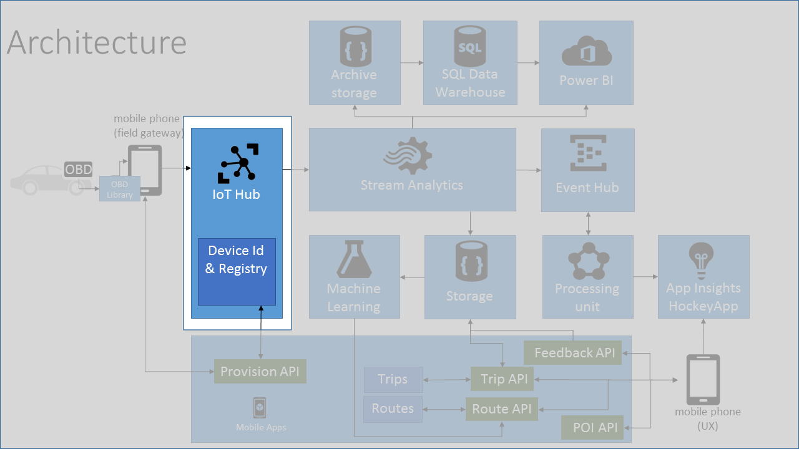
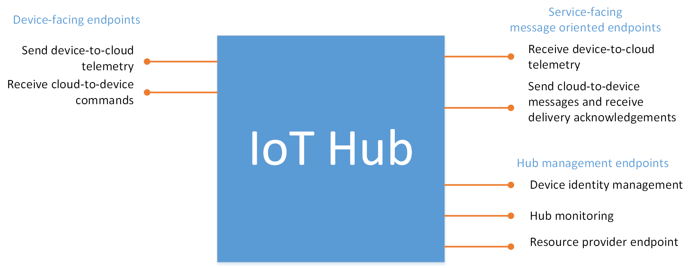

# What is IoT Hub?

[Azure IoT Hub][lnk-iot-hub] is a fully managed service that enables reliable and secure bidirectional communications between millions of IoT devices and a solution back end. Azure IoT Hub:

- Provides reliable device-to-cloud and cloud-to-device messaging at scale.
- Enables secure communications using per-device security credentials and access control.
- Provides extensive monitoring for device connectivity and device identity management events.
- Includes device libraries for the most popular languages and platforms.

## Reliable device-to-cloud and cloud-to-device messaging at scale

IoT Hub can reliably receive millions of messages per second from your devices and retains the message data for up to seven days to guarantee reliable processing by your solution back end and to absorb peaks in the load. The solution back end can use IoT Hub to send messages with an at-least-once delivery guarantee to individual devices.

Azure IoT Hub scales to millions of simultaneously connected devices and millions of messages per second.

## Secure communications

You can provision each device with its own security key to enable it to connect to IoT Hub. The IoT Hub *identity registry* in your IoT hub stores the device identities and keys for your solution. A solution back end can whitelist and blacklist individual devices.

## Monitoring

You can receive detailed operation logs about device identity management operations and device connectivity events. This enables your IoT solution to easily identify connectivity issues, such as devices that try to connect with wrong credentials, send messages too frequently, or reject all cloud-to-device messages sent to them.

## Device libraries

[Azure IoT device SDKs][lnk-iot-sdks] are available and supported for a variety of languages and platforms. There is a C library for many Linux distributions, Windows, and real-time operating systems. There are also SDKs for managed languages, such as C#, Java, and JavaScript.

## IoT Hub endpoints

IoT Hub exposes several endpoints that enable devices and other cloud-based services to interact with the service:

Each IoT Hub exposes two device facing endpoints that you can access using the HTTP, AMQP, or MQTT protocols:

- *Send device-to-cloud telemetry*. A device can connect to this endpoint to send messages to the solution back end. In this solution, phone (acting as a field gateway) connects to this endpoint using the [TODO] protocol to forward the data from the OBD device.
- *Receive cloud-to-device commands*. A device can connect to this endpoint to retrieve any messages sent to the device by the solution back end. IoT Hub maintains a separate queue for each device to deliver these cloud-to-device messages. The solution does not make use of this endpoint.

Each IoT Hub exposes three service endpoints that you can access using the AMQP protocol:

- *Receive device-to-cloud telemetry*. A back-end service can connect to this endpoint to retrieve any messages sent to the hub from a device. This endpoint is compatible with [Azure Event Hubs][lnk-event-hubs] and you can connect to it using any of the interfaces and SDKs that support Event Hubs. In this solution, the Azure Stream Analytics service can connect directly to this endpoint because **Event Hub** is a valid **Source Type** for a Stream Analytics job.
- *Send cloud-to-device commands and receive delivery acknowledgments*. These two endpoints enable your solution back end to send reliable cloud-to-device messages, and to receive the corresponding delivery or expiration acknowledgments. The solution does not make use of these endpoints.

In addition to the message oriented endpoints, IoT Hub also exposes these endpoints:

- *Device identity management*. You can use this HTTP REST endpoint to manage the device identity registry in your IoT hub. You can create, retrieve, update, and delete the device identities that the solution uses for device authentication and access control.
- *Hub monitoring*. You can use this Event Hub-compatible endpoint to collect monitoring data from your IoT hub about device identity operations, device-to-cloud communications, cloud-to-device communications, and connections to the hub.
- *Resource provider*. The IoT Hub resource provider exposes an [Azure Resource Manager][lnk-arm] interface that enables Azure subscription owners to create IoT hubs, update IoT hub properties, delete IoT hubs, and perform bulk device identity import and export operations. The script that you can use to deploy this solution to your own Azure subscription makes use of this endpoint. The device provisioning component in this solution uses these endpoints to register new devices.

# IoT Hub security and the service-assisted communication pattern

Azure IoT Hub implements the [service-assisted communication][lnk-service-assisted-pattern] pattern to mediate the interactions between your IoT devices and your solution back end. The goal of service-assisted communication is to establish trustworthy, bidirectional communication paths between a control system, such as IoT Hub, and special-purpose devices that are deployed in untrusted physical space. The pattern establishes the following principles:

- Security takes precedence over all other capabilities.
- Devices do not accept unsolicited network information. A device establishes all connections and routes in an outbound-only fashion. For a device to receive a command from the back end, the device must regularly initiate a connection to check for any pending commands to process.
- Devices should only connect to or establish routes to well-known services, such as IoT Hub, they are peered with, such as IoT Hub.
- The communication path between device and service or between device and gateway is secured at the application protocol layer.
- System-level authorization and authentication are based on per-device identities. They make access credentials and permissions nearly instantly revocable.
- Bidirectional communication for devices that connect sporadically due to power or connectivity concerns is facilitated by holding commands and device notifications in until a device connects to receive them. IoT Hub maintains device specific queues for the commands it sends.
- Application payload data is secured separately for protected transit through gateways to a particular service.

The mobile industry has successfully used the service-assisted communication pattern at enormous scale to implement push notification services such as [Windows Push Notification Services][lnk-wns], [Google Cloud Messaging][lnk-google-messaging], and [Apple Push Notification Service][lnk-apple-push].

# Why is IoT Hub a good fit for this solution and what does it do in the solution?

# How do I set up an IoT hub?

# How do I provision devices?

[Graphic: identity registry]

# How do I manage my devices?

# How do I scale my IoT hub?

# How do I read messages from my devices?

# How do I send commands to my devices?

# Troubleshooting
Monitoring and metrics

[lnk-service-assisted-pattern]: http://blogs.msdn.com/b/clemensv/archive/2014/02/10/service-assisted-communication-for-connected-devices.aspx "Service Assisted Communication, blog post by Clemens Vasters"
[lnk-wns]: https://msdn.microsoft.com/library/windows/apps/mt187203.aspx
[lnk-google-messaging]: https://developers.google.com/cloud-messaging/
[lnk-apple-push]: https://developer.apple.com/library/ios/documentation/NetworkingInternet/Conceptual/RemoteNotificationsPG/Chapters/ApplePushService.html#//apple_ref/doc/uid/TP40008194-CH100-SW9
[lnk-event-hubs]: http://azure.microsoft.com/documentation/services/event-hubs/
[lnk-arm]: https://azure.microsoft.com/documentation/articles/resource-group-overview/
[lnk-iot-hub]: http://azure.microsoft.com/documentation/services/iot-hub/
[lnk-iot-sdks]: https://github.com/Azure/azure-iot-sdks
